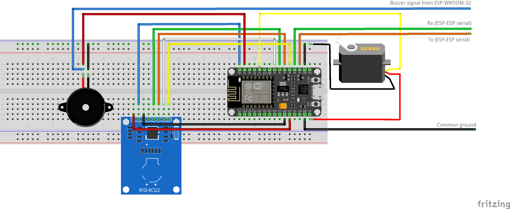

# RFID

## RFID
Code for RFID part of project involving door access control running on two ESPs and a webserver.

## api_caller
Library to support the requests and responses to/from the server

## hash
Simple function to hash passwords and RFID tags.

## Syntax for Serial Communication between ESPs

### From Keypad ESP to RFID ESP
Syntax:

 `<COMMAND>,<hashedPassword>(optional),<userIndex>(optional),<hashedMasterPassword>(optional)`

### Commands
From Keypad ESP to RFID ESP

`LOGIN`

`NEW_PASSWORD`

`NEW_RFID`

`CANCEL_RFID`

From RFID ESP to Keypad ESP

`ACCESS`

`ACCESS_DENIED`

`RFID_READ`

### Examples & Description:
#### User Login:
A login with a password (PIN) is attempted from the keypad.

Keypad Sends:

`LOGIN,<hashedPassword>, , `

#### New User Password:
From the admin menu on the keypad, a request to register a new password for a user is sent.

Keypad Sends:

`NEW_PASSWORD,<hashedPassword>,<userIndex>,<hashedMasterPassword>`

#### New User RFID:
From the admin menu on the keypad, a request to register a new RFID chip/card for a user is sent.

Keypad Sends:

`NEW_RFID, ,<userIndex>,<hashedMasterPassword>`

Cancel RFID registration: (Only used for information as the RFID part has a timeout of no key is presented)

`CANCEL_RFID, , , `

### From RFID ESP To Keypad ESP
Syntax: 

`<COMMAND>,<userIndex>(optional)`

### Examples:
#### User Has Logged In:
If a login was processed and access granted RFID ESP sends:

`ACCESS,<userIndex>`

#### Wrong Password:
If a login was processed and access denied RFID ESP sends:

`ACCESS_DENIED,`

#### New User RFID created:
After a new RFID has been read, the RFID ESP sends the following command to verify that the Keypad ESP can exit the menu:

`RFID_READ,`

If instead an RFID chip was not read or an error occured the RFID ESP will send:

`ACCESS_DENIED,`

## Circuit diagram
