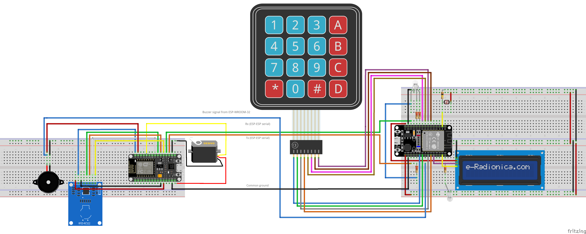

# Security Access system
Created for course 34338 - Telecommunication programming projects with Arduino.

A door access security system for everyday use. The implemented log-on possibilities are RFID, PIN, and bluetooth from a mobile phone.

The system consists of three parts:

1. A node.js server running a temporary database (by design so we did not need to clear the database all the time).
2. An ESP8266 with:
   1. RFID Reader.
   2. Servo Motor ("Door/Lock").
   3. Buzzer.
3. An ESP32-WROOM-32 with:
   1. Liquid Crystal Display for user feedback as well as access admin menu.
   2. keypad.
   3. RGB LED for feedback.
   4. White LED ("Keypad light").
   5. Photoresistor (Controlling White LED).
   
If a user enters a PIN on the keypad, a request with a hashed version of the PIN is sent from the ESP32 to the ESP8266. If the ESP8266 has WiFi, it will pass the request on to the server.
If the response is valid and access is granted, the ESP8266 will open the door and send a request to the ESP32 to update the LCD and as well as the RGB LED.

If a user presents an RFID tag, and the ESP8266 has WiFi, it will pass the request on to the server.
If the response is valid and access is granted, the ESP8266 will open the door and send a request to the ESP32 to update the LCD and as well as the RGB LED.

Should the response in either case be invalid or access not granted, then the door will not open, and a request will be sent from the ESP8266 to the ESP32 to change the LCD and RGB LED accordingly.

Should the ESP8266 not have a WiFi connection, it will instead look in the EEPROM to check if a match is stored there.

On any access granted or access denied response from the server, the ESP8266 checks the locally stored information and any needed update to the local information is performed. This is only done on event-by-event basis, meaning not the entire local user database is updated each time.

## Responsibilities

| Functionalities | Main | Secondary|
|---|---|---|
| API | Mads | Maria |
| Server | Maria | Mads |
| LCD | Andreas | Maria |
| LEDs | Mads | Maria |
| Buzzer | Christian | Lukas |
| Serial communication | Alexander | Lukas, Mads, Andreas |
| EEPROM | Lukas | Christian |
| RFID | Christian | Lukas |
| Keypad | Andreas | Alexander |
| Photoresistor | Maria | Mads |
| WiFi | Lukas | Mads |
| Bluetooth | Alexander | |
| Hash | Andreas | |
| Servo motor | Christian | |
|Final integration | Lukas, Alexander, Mads | |

## Circuit diagram
